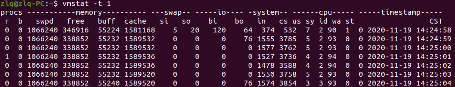

1. 记录性能数据

   1. cpu

      ```
      vmstat -t  1 > stat.log
      # 每秒记录一次数据
      ```

        

      top -d 60  -n 2 -b >top.log

      JAVA gc 情况

      ```
   jstat -gc <pid> 1000 > gc.log
      ```
   
      
   
   2. 内存
   
   3. 磁盘
   
   4. 网络

 

