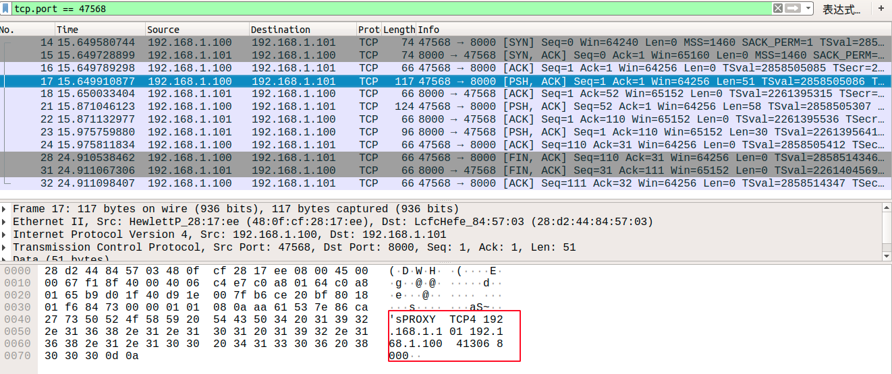
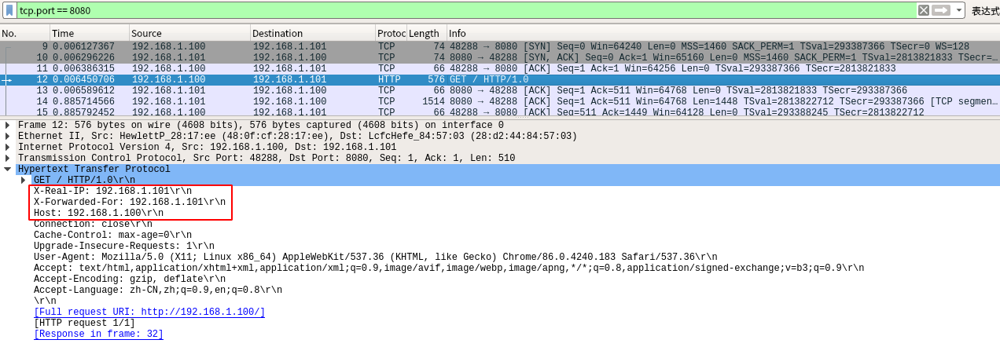

Nginx 反向代理后如何获取real IP.

[toc]

# 4层反向代理

开启proxy_protocol on;

默认发送`PROXY TCP4 来源IP 本地IP 来源Port 本地Port`

 `PROXY TCP4 192.168.1.101 192.168.1.100 48208 8000`

```
# 当前Nginx服务器所在地IP为192.168.1.100
stream {
	upstream wayne_api {
		server 192.168.1.101:8000;
	}
	server {
		listen 8000;
        proxy_pass wayne_api;
        proxy_protocol on;
	}
}
```




```
0000   28 d2 44 84 57 03 48 0f cf 28 17 ee 08 00 45 00   (?D.W.H.?(.?..E.
0010   00 67 f1 8f 40 00 40 06 c4 e7 c0 a8 01 64 c0 a8   .g?.@.@.????.d??
0020   01 65 b9 d0 1f 40 d9 1e 00 7f b6 ce 20 bf 80 18   .e??.@?...?? ?..
0030   01 f6 84 73 00 00 01 01 08 0a aa 61 53 7e 86 ca   .?.s......?aS~.?
0040   27 73 50 52 4f 58 59 20 54 43 50 34 20 31 39 32   'sPROXY TCP4 192
0050   2e 31 36 38 2e 31 2e 31 30 31 20 31 39 32 2e 31   .168.1.101 192.1
0060   36 38 2e 31 2e 31 30 30 20 34 31 33 30 36 20 38   68.1.100 41306 8
0070   30 30 30 0d 0a                                    000..
```

[抓包附件](assers/nginx/nginx_proxy_protoct_zhubao.pcap)

参考

[Nginx+netty获取tcp连接对端的真实IP](https://juejin.cn/post/6858167170342649869)


# 7层（HTTP）反向代理。

ngx_http_realip_module

http://nginx.org/en/docs/http/ngx_http_realip_module.html

```
server {
	listen 80;
    server_name  localhost;
    index index.html index.htm;
    access_log /data/nginx.access.log;
    location ~ .* {
    	proxy_pass http://192.168.180.20;
        proxy_set_header X-Real-IP $remote_addr;
        proxy_set_header X-Forwarded-For $proxy_add_x_forwarded_for;
        #proxy_set_header X-Forward-For $remote_addr;
        proxy_set_header Host $host;
        set_real_ip_from  192.168.180.0/24;
        set_real_ip_from 192.168.181.0/24;
        real_ip_header    X-Forwarded-For;
        real_ip_recursive on;
    }
}
```

例如： A: 192.168.1.100, B: 192.168.1.101

A 部署Nginx,

B 部署Tomcat

A 代理B，从B访问A的nginx.

nginx 日志

```
192.168.1.101 - - [30/Nov/2020:11:26:12 +0800] "GET / HTTP/1.1" 200 2375 "-" "Mozilla/5.0 (X11; Linux x86_64) AppleWebKit/537.36 (KHTML, like Gecko) Chrome/86.0.4240.183 Safari/537.36"
# 
```

tomcat 的 access日志：

```
192.168.1.100 - - [30/Nov/2020:11:26:12 +0800] 192.168.1.101 "GET / HTTP/1.0" 200 11196
```

抓包结果：

  


如果有问题1：访问到服务，页面异常，去除proxy_set_header等配置则访问正常。

```javascript
location / {
    proxy_pass https://192.168.10.3:443/;
    proxy_set_header Host $http_host;
    proxy_set_header X-Real-IP $remote_addr;
    proxy_set_header X-Forwarded-For $proxy_add_x_forwarded_for;
    proxy_set_header X-Forwarded-Proto $scheme;
}
```

来源 https://cloud.tencent.com/developer/article/1586190