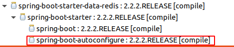

Spring-data-redis 源码分析

[toc]

# 业务分析

> Spring Data Redis, part of the larger Spring Data family, provides easy configuration and access to Redis from Spring applications. It offers both low-level and high-level abstractions for interacting with the store, freeing the user from infrastructural concerns.

1. 向下整合多种驱动（Jedis和Lettuce)
2. 向上提供一致性调用接口，操作Redis.
   1. redis基本操作
   2. 集群操作
   3. 哨兵模式操作
3. 提供丰富序列化功能
   1. 字符串序列化
   2. 对象序列化
4. 

# 基本使用

- 没有使用Spring容器的例子

```java
import org.junit.Test;
import org.springframework.data.redis.connection.RedisConnectionFactory;
import org.springframework.data.redis.connection.jedis.JedisConnectionFactory;
import org.springframework.data.redis.core.RedisTemplate;
import org.springframework.data.redis.serializer.StringRedisSerializer;

public class RedisTemplateTest {

	public RedisTemplate<String, Object> redisTemplate(RedisConnectionFactory factory) {
		RedisTemplate<String, Object> template = new RedisTemplate<>();
		template.setConnectionFactory(factory);
		template.setKeySerializer(new StringRedisSerializer());
		template.setHashKeySerializer(new StringRedisSerializer());
		template.setValueSerializer(new StringRedisSerializer());
		template.afterPropertiesSet(); // 没有使用Spring容器，则需要手动调用
		return template;
	}

	public JedisConnectionFactory redisConnectionFactory() {
        // 这里可以配置多种Redis模式的配置：集群模式，哨兵模式，默认使用客户端线程池apache common-pool3
		JedisConnectionFactory factory = new JedisConnectionFactory();
		factory.setHostName("192.168.1.100");
		factory.setPassword("123456");
		return factory;
	}

	@Test
	public void test() {
		JedisConnectionFactory factory = redisConnectionFactory();
		factory.afterPropertiesSet();  // 没有使用Spring容器，则需要手动调用
		System.out.println(factory);
		RedisTemplate<String, Object> redisTemplate = redisTemplate(factory);
		System.out.println(redisTemplate);
		Object string = redisTemplate.opsForValue().get("string-key-1");
		System.out.println(string);
	}
}
```

- 使用Spring容器管理的例子

```xml
<bean id="jedisConnFactory"
    class="org.springframework.data.redis.connection.jedis.JedisConnectionFactory"
    p:use-pool="true"/>

<!-- redis template definition -->
<bean id="redisTemplate"
    class="org.springframework.data.redis.core.RedisTemplate"
    p:connection-factory-ref="jedisConnFactory"/>
```

```java
public class Example {

    // inject the actual template
    @Autowired
    private RedisTemplate<String, String> template;

    // inject the template as ListOperations
    // can also inject as Value, Set, ZSet, and HashOperations
    // 为啥可以参考： https://www.cnblogs.com/tangyuanyuan/p/8067923.html
    // 			    https://blog.csdn.net/u012123179/article/details/105892392/
    @Resource(name="redisTemplate") 
    private ListOperations<String, String> listOps;

    public void addLink(String userId, URL url) {
        listOps.leftPush(userId, url.toExternalForm());
        // or use template directly
        redisTemplate.boundListOps(userId).leftPush(url.toExternalForm());
    }
}
```


- 使用SpringBoot的例子

```
引入依赖： spring-boot-starter-data-redis
配置application.yml
spring:
  redis:
    timeout: 2000
    password: 123456
    cluster:
      nodes: 127.0.0.1:9001,127.0.0.1:9002,127.0.0.1:9003
```

spring-boot-starter-data-redis的源码非常简单，使用lettuce-core作为客户端，

```
plugins {
	id "org.springframework.boot.starter"
}

description = "Starter for using Redis key-value data store with Spring Data Redis and the Lettuce client"

dependencies {
	api(project(":spring-boot-project:spring-boot-starters:spring-boot-starter"))
	api("org.springframework.data:spring-data-redis")
	api("io.lettuce:lettuce-core")
}
```

在spring-boot-autoconfigure包中，配置类RedisAutoConfiguration

```java
@Configuration(proxyBeanMethods = false)
@ConditionalOnClass(RedisOperations.class)
@EnableConfigurationProperties(RedisProperties.class) //启动导入配置
@Import({ LettuceConnectionConfiguration.class, JedisConnectionConfiguration.class })
public class RedisAutoConfiguration {

	@Bean
	@ConditionalOnMissingBean(name = "redisTemplate")
	public RedisTemplate<Object, Object> redisTemplate(RedisConnectionFactory redisConnectionFactory)
			throws UnknownHostException {
		RedisTemplate<Object, Object> template = new RedisTemplate<>();
		template.setConnectionFactory(redisConnectionFactory);
		return template;
	}

	@Bean
	@ConditionalOnMissingBean
	public StringRedisTemplate stringRedisTemplate(RedisConnectionFactory redisConnectionFactory)
			throws UnknownHostException {
		StringRedisTemplate template = new StringRedisTemplate();
		template.setConnectionFactory(redisConnectionFactory);
		return template;
	}

}
```

@EnableConfigurationProperties(RedisProperties.class)  //  从application.yml导入的配置

@Import({ LettuceConnectionConfiguration.class, JedisConnectionConfiguration.class })  //负责导入具体的连接配置

```
package org.springframework.boot.autoconfigure.data.redis;

//省略impot...

@Configuration(proxyBeanMethods = false)
@ConditionalOnClass({ GenericObjectPool.class, JedisConnection.class, Jedis.class })
class JedisConnectionConfiguration extends RedisConnectionConfiguration {

	JedisConnectionConfiguration(RedisProperties properties,
			ObjectProvider<RedisSentinelConfiguration> sentinelConfiguration,
			ObjectProvider<RedisClusterConfiguration> clusterConfiguration) {
		super(properties, sentinelConfiguration, clusterConfiguration);
	}

	@Bean
	@ConditionalOnMissingBean(RedisConnectionFactory.class)
	JedisConnectionFactory redisConnectionFactory(
			ObjectProvider<JedisClientConfigurationBuilderCustomizer> builderCustomizers) throws UnknownHostException {
		return createJedisConnectionFactory(builderCustomizers);
	}
	
}
```


  

# 问题

1. RedisTemplate that could not be found如何解决？

   ```
   @Autowired
   private RedisTemplate<String, Object> template;
   ```

   原因： 是@Autowired是按类型导入，默认的RedisTemplate<Object, Object>, 

   解决： 改成对应的类型或使用@Resource注解注入

2. 

参考

TODO https://blog.csdn.net/striveb/article/details/85019370

