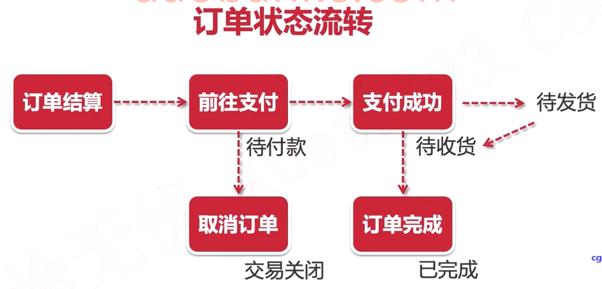
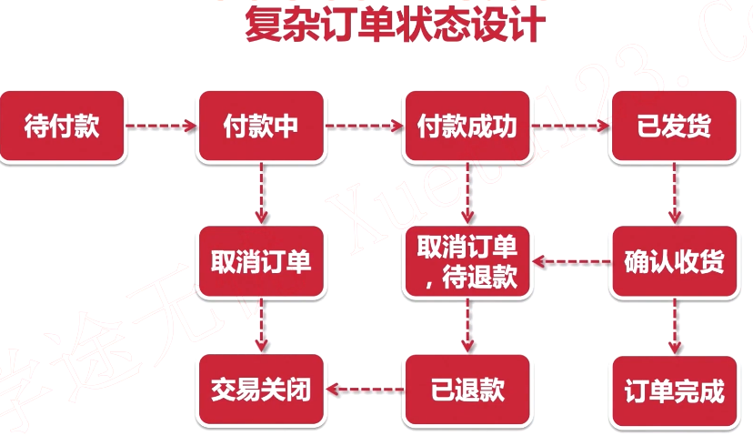
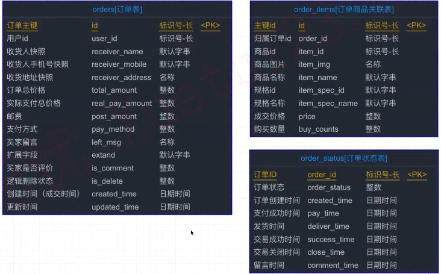

[toc]

# 订单的简单流程

订单解算 --> 前往支付 --> 支付成功 --> 待发货 --> 发货 --> 订单完成--订单标记“已完成”

前往支付--待付款--> 取消订单--订单标记“交易关闭”

  

# 订单的复杂流程

  

# 订单的表设计

  

1. 订单的收货人，收货地址，应该使用快照
2. 可以讲订单表进行逻辑才分成多个表，比如订单创建时间，订单付款时间等。
3. 商品的ID的记录是为了以后查询对比。
4. 因为订单是个历史数据，所以是不能改变，需要将能变得部分，进行快照处理。
5. 

# 支付中心表设计

  

# 微信支付接口

[微信支付接口文档-https://pay.weixin.qq.com/wiki/doc/api/index.html](https://pay.weixin.qq.com/wiki/doc/api/index.html)

1. 微信通知回调10次频率

     

2. 

